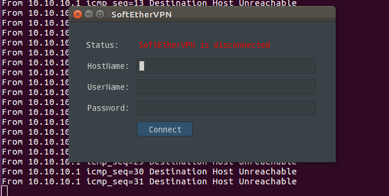

gosec - go SoftEtherVPN Client
---
A client in pure go for [SoftEtherVPN](https://github.com/SoftEtherVPN/SoftEtherVPN), based on [nucular](https://github.com/aarzilli/nucular), [water](github.com/songgao/water) and other packages.
The name *gosec* could be read as either "go SoftEtherVPN Client" or "go secure".

About two years ago(2017), go comes to my world and fascinates me. Then I dream to do everyting with go, including a mobile app for SoftEtherVPN.
Yet, after millions of survey and try, I give up, go is not designed for mobile development, although there are many temptations in github, all of them are premature. 

A side effect is that a work flow has been built up with a simple UI, that is gosec. 
Before uploading to github, it is polished, adapted to the change of underlying packages(e.g. u-root), modules support has been added, and verify running well in my Ubuntu desktop.

How to build and run
---
It doesn't support `go get`, just use traditional `git clone`.
Require go 1.12 and only Linux platform supported because some underlying packages require.
Then `go build` is enough if all dependencies are properly setup.

To simplely run up the binary, root privilege is required in order to create a TAP interface underneath:
```
	sudo ./gosec
```
Or, with debug:
```
	 sudo ./gosec -debug print
```
Or, debug log sent to a remote server:
```
	 sudo ./gosec -debug logserver -host logserver_IP:port
```

The logserver code is sitting in logserver directory. `go build` there, then run locally or copy to a remote host:
```
	 ./logserver -hostport localhost:4433
```
By default the logserver is running in SSL with a self-signed certificate, replace the certificate if stronger security is under consideration.

Use `-h` to see all available options.



Limitation
---
This is done in my leisure time, and go is not my primary language, so the code may be naive.
Only plain user name password login supported, only SSL connection for security, no many features supported.
As said, the major work is done two years ago, the underlying packages may have evolved, but new features are not in, 
such as nucular. 

Future
---
I won't pick up again unless it proves many interests. Just code for fun :) 


